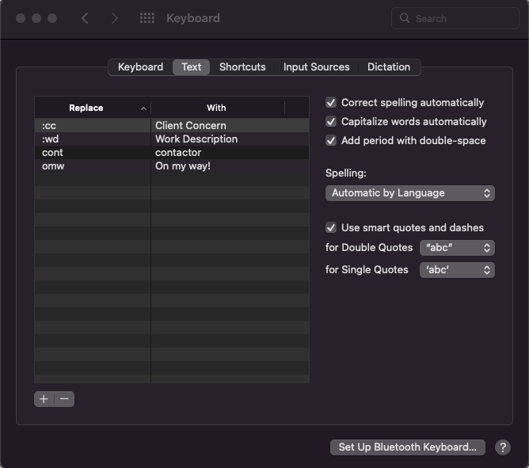
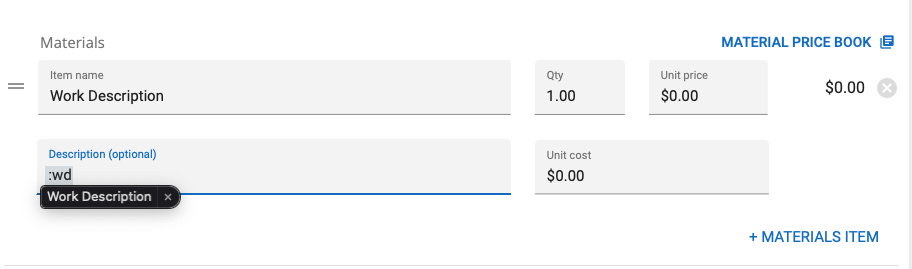

# Text Substitution Shortcuts

Adding text substitution shortcuts can allow you to type a few characters and have the text replace or suggested.

## Builtin Method on macOS

To create a text substitution suggestion on macOS they can be customized in System Preferences -> Keyboard -> Text.
You can then enter the characters you would like a substitution suggestions to recognize.

The upside of using the builtin method is that these will sync across all your devices that are signed into your
iCloud account.  The downside is that the text is a pop-up suggestion and requires the user to select the text before
replacement occurs, as in the image below.

## Builtin Method on iOS

The way to add text substitution options on iOS is similar to macOS.  The settings can be customized in
Settings -> General -> Keyboard -> Text Replacement.

## Alternatives

Another alternative is to use a text expander application.  Personally I use [Espanso](https://espanso.org).  While
setting up a text expander is beyond the scope of this note, it will automatically replace the text based on the
symbols / patterns that you create.

