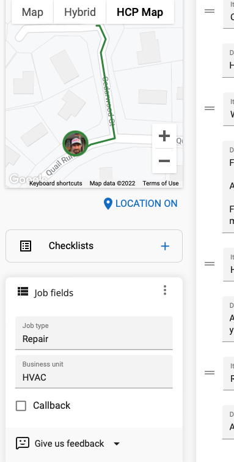

# Setting Job Fields When Scheduling

Using the `Job Fields` section when scheduling a job allows us better filters for reports and statistics, so they
should be set when the job is scheduled and / or updated by the technician in the field (i.e. for callbacks).

