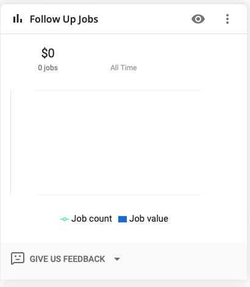

# Filter Jobs by Follow-Up Tag

There is a custom report that was made that allows the office / csr to quickly filter jobs that are tagged with the
`Follow-Up` tag.  You access the report from the `Dash` section.  Unless you have rearranged your dashboard the report
is likely not visible until you click the `SHOW MORE` button at the bottom.

The dashboard item has a title of `Follow-Up Jobs`. Clicking on the `Eye` icon will take you to a report page that can
allow you to view or filter the jobs even further if needed.

