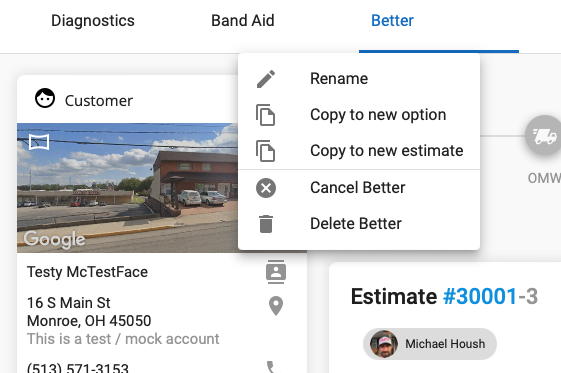

# Delete Segments to Delete a Job

To delete an estimate or job that has segments or multiple options, you have to delete each segment
in order for the job or estimate to be delete.  Click on the 3 dots next to the segment or option,
then choose delete.

