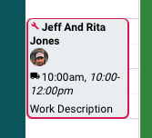

# Recognize When A Job Has Not Been Payed On The Schedule

When a job is completed (marked when technician hits the `finish` button in
the field, the color on the schedule will turn to grey.  If the job was not
marked as paid, then it will have a red outline around it.

