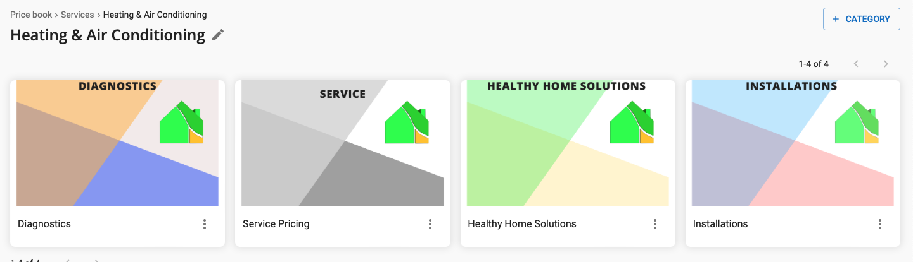

# Understand The Service Price-book Categories

The service price-book is broken into 4 categories, `Diagnostics`, `Service`,
`Healthy Home Solutions`, and `Installations`.

## Diagnostics

The diagnostics category houses services that are typically selected as the
initial reason for a service call.  They include standard diagnostic terminology
for normal business hours and after hours services.

It also includes advanced diagnostics, such as `Comfort Consult`, `Duct Leakage`,
`Combustion`, etc.

## Service Pricing

This includes the items that would be used by service technicians.  These are
are broken into categories that made the most sense at the time of creating
the price-book.  Each category includes services that fall into a Level-0
through a Level-6 Repair.

The Level-0 repair is a new addition for those services that are not very
involved, however are above the diagnostic charge (clean a flame sensor, for
example).

## Healthy Home Solutions

This includes `IAQ` items, each category has a sub-category that has pricing
for whether the item is being installed during equipment installation or as a
standalone service.

## Installations

This category includes services that we would fall under the installation side
of the business and are typically used for creating estimates.

This category also has sub-categories of if the item is being installed with
other equipment or not.
