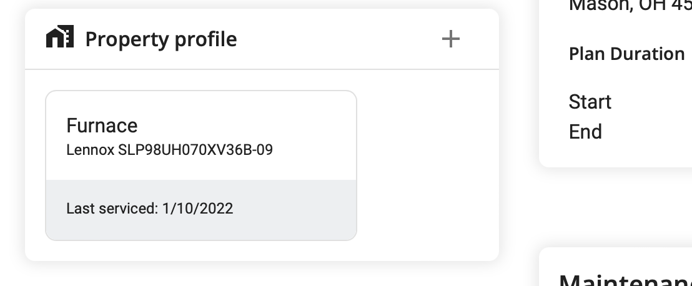

# Associate Equipment With a Service Membership

Once an piece of equipment is saved in the `property profile` it can be
associated with being covered under a `service membership` plan.

Click on the `service plan` from the customer's profile then add
the item under `property profile` (must have already been created).

